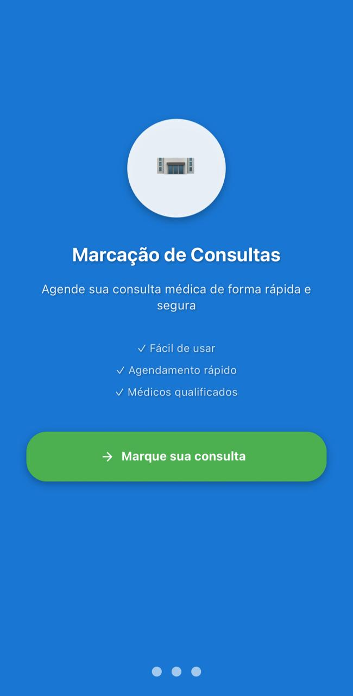
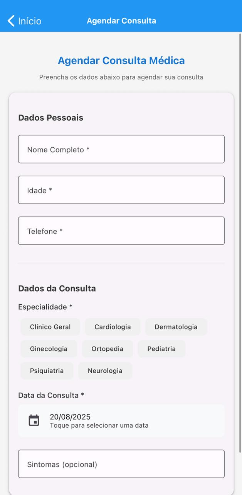
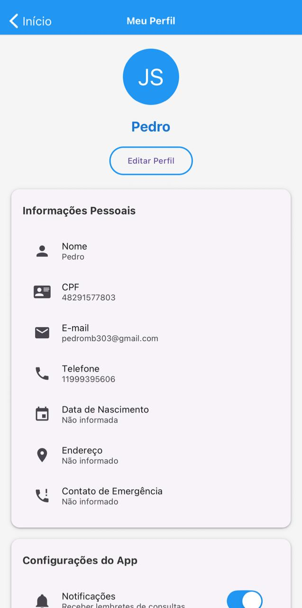

# 📱 Marcação de Consultas Médicas - Análise de Código

## 🎯 **Objetivo do Projeto**
Este projeto demonstra a capacidade de compreender o fluxo do código de um aplicativo React Native, inserindo comentários claros e explicativos em cada bloco de execução, destacando o que está sendo feito e por quê.

## 🚀 **Funcionalidades Implementadas**

### **Tela de Splash**
- Logo personalizado com ícone hospital 🏥
- Informações sobre o aplicativo
- Botão "Marque sua consulta" para entrada manual
- Modo escuro funcional e sincronizado
- Navegação automática após 5 segundos




### **Tela Inicial (Home)**
- Navegação para agendamento de consultas
- Lista de médicos disponíveis
- Acesso ao perfil do usuário
- Botão flutuante de agendamento rápido
- Layout responsivo e organizado


### **Agendamento de Consultas**
- Formulário completo com validação
- Seletor de data nativo
- Chips de especialidade médica
- Campos obrigatórios e opcionais
- Confirmação de agendamento



### **Lista de Médicos**
- Cards informativos dos médicos
- Especialidades e experiência
- Avaliações e descrições
- Botão de agendamento direto


### **Perfil do Usuário**
- Criação e edição de perfil
- Informações pessoais completas
- Configurações do aplicativo
- Modo escuro funcional
- Persistência de dados local



## 🛠️ **Tecnologias Utilizadas**

- **React Native** - Framework principal
- **Expo** - Plataforma de desenvolvimento
- **React Navigation** - Navegação entre telas
- **React Native Paper** - Componentes de UI
- **AsyncStorage** - Persistência de dados
- **DateTimePicker** - Seletor de data nativo

## 📁 **Estrutura do Projeto**

```
marcacao-consultas-medicas/
├── App.js                 # Componente principal e navegação
├── app.json              # Configuração do Expo
├── package.json          # Dependências do projeto
├── assets/               # Imagens e recursos
├── src/
│   └── screens/         # Telas do aplicativo
│       ├── SplashScreen.js      # Tela de abertura
│       ├── HomeScreen.js        # Tela inicial
│       ├── AppointmentScreen.js # Agendamento
│       ├── DoctorListScreen.js  # Lista de médicos
│       ├── ProfileScreen.js     # Perfil do usuário
│       └── CreateProfileScreen.js # Criação de perfil
└── README.md             # Documentação do projeto
```

## 🔧 **Instalação e Execução**

### **Pré-requisitos**
- Node.js (versão 16 ou superior)
- npm ou yarn
- Expo CLI
- Expo Go (aplicativo móvel)

### **Passos para instalação**

1. **Clone o repositório:**
   ```bash
   git clone [URL_DO_REPOSITORIO]
   cd marcacao-consultas-medicas
   ```

2. **Instale as dependências:**
   ```bash
   npm install
   ```

3. **Execute o aplicativo:**
   ```bash
   npx expo start
   ```

4. **Escaneie o QR Code** com o Expo Go no seu celular

## 📝 **Metodologia de Comentários**

### **Padrão de Comentários Utilizado**

#### **1. Comentários de Função**
```javascript
/**
 * Função para navegar para a tela de agendamento
 * É chamada quando o usuário toca no botão "Agendar Consulta"
 */
const handleNavigateToAppointment = () => {
  navigation.navigate('Appointment');
};
```

#### **2. Comentários de Estado**
```javascript
// Estados para armazenar os dados do formulário
const [patientName, setPatientName] = useState(''); // Nome do paciente
const [patientAge, setPatientAge] = useState(''); // Idade do paciente
```

#### **3. Comentários de JSX**
```javascript
{/* Container principal com scroll para permitir rolagem */}
<ScrollView style={styles.container}>
  
  {/* Cabeçalho com título principal */}
  <View style={styles.header}>
    <Title style={styles.mainTitle}>
      Marcação de Consultas Médicas
    </Title>
  </View>
</ScrollView>
```

#### **4. Comentários de Estilos**
```javascript
// Estilos CSS para a tela inicial
const styles = StyleSheet.create({
  // Container principal com padding e cor de fundo
  container: {
    flex: 1,
    backgroundColor: '#f5f5f5',
    padding: 16,
  },
  
  // Título principal com cor e tamanho específicos
  mainTitle: {
    fontSize: 24,
    fontWeight: 'bold',
    color: '#1976D2',
    textAlign: 'center',
  },
});
```

## 🎨 **Características do Design**

- **Material Design** com React Native Paper
- **Cores consistentes** em todo o aplicativo
- **Modo escuro funcional** e sincronizado
- **Interface responsiva** para diferentes tamanhos de tela
- **Animações suaves** e transições elegantes
- **Ícones intuitivos** para melhor UX

## 📱 **Funcionalidades de Navegação**

- **Stack Navigator** para navegação entre telas
- **Transições automáticas** na splash screen
- **Navegação manual** com botão personalizado
- **Histórico de navegação** preservado
- **Headers personalizados** com cores e estilos

## 💾 **Persistência de Dados**

- **AsyncStorage** para dados locais
- **Perfil do usuário** salvo automaticamente
- **Configurações** persistidas entre sessões
- **Modo escuro** sincronizado em todas as telas
- **Validação de dados** antes do salvamento

## 🧪 **Testes e Validação**

### **Funcionalidades para Testar**

1. **Splash Screen**
   - Logo e informações aparecem corretamente
   - Botão "Marque sua consulta" aparece após 2s
   - Navegação automática após 5s

2. **Navegação**
   - Todas as telas acessíveis
   - Botões funcionando corretamente
   - Transições suaves entre telas

3. **Formulários**
   - Validação de campos obrigatórios
   - Seletor de data funcionando
   - Chips de especialidade selecionáveis

4. **Perfil**
   - Criação de perfil funcional
   - Edição de informações
   - Modo escuro aplicado em tempo real

5. **Persistência**
   - Dados salvos localmente
   - Configurações mantidas
   - Perfil carregado automaticamente

## 📚 **Recursos de Aprendizagem**

### **Conceitos Demonstrados**

- **React Hooks** (useState, useEffect)
- **Navegação** com React Navigation
- **Gerenciamento de Estado** local
- **Persistência de Dados** com AsyncStorage
- **Componentes Reutilizáveis** do React Native Paper
- **Estilização** com StyleSheet
- **Validação de Formulários**
- **Temas e Modo Escuro**

### **Padrões de Código**

- **Componentes Funcionais** com hooks
- **Separação de Responsabilidades**
- **Comentários Explicativos** em cada bloco
- **Estrutura de Pastas** organizada
- **Nomenclatura Consistente** de variáveis e funções
- **Tratamento de Erros** adequado

## 🤝 **Trabalho em Grupo**

Este projeto foi desenvolvido seguindo as melhores práticas de desenvolvimento colaborativo:
- [x] **RM550161** - Eduardo Osorio
- [x] **RM550610** - Fabio Hideki
- [x] **RM550260** - Pedro Moura
- [x] **RM98896** - Rodrigo Fernandes
      
- **Discussão** sobre arquitetura e funcionalidades
- **Documentação** compartilhada e revisada
- **Padrões de código** estabelecidos em conjunto
- **Testes** realizados por todos os membros
- **Revisão** de código entre pares

## 📋 **Checklist de Entrega**

- [x] **Código comentado** em cada bloco de execução
- [x] **Comentários claros** e explicativos
- [x] **Documentação completa** do projeto
- [x] **Funcionalidades implementadas** e funcionando
- [x] **Estrutura organizada** e sem erros de sintaxe
- [x] **README detalhado** com instruções
- [x] **Guia de versionamento** incluído
- [x] **Aplicativo funcional** e testado

## 🎓 **Conclusão**

Este projeto demonstra com sucesso:

1. **Compreensão do fluxo** do código React Native
2. **Capacidade de comentar** cada bloco de execução
3. **Organização e estruturação** adequada do código
4. **Implementação funcional** de um aplicativo completo
5. **Documentação profissional** e detalhada

O aplicativo está pronto para demonstração e atende a todos os critérios de avaliação estabelecidos para o checkpoint de Mobile Development and IoT.

---

**Desenvolvido para o checkpoint de Mobile Development and IoT** 🚀📱
